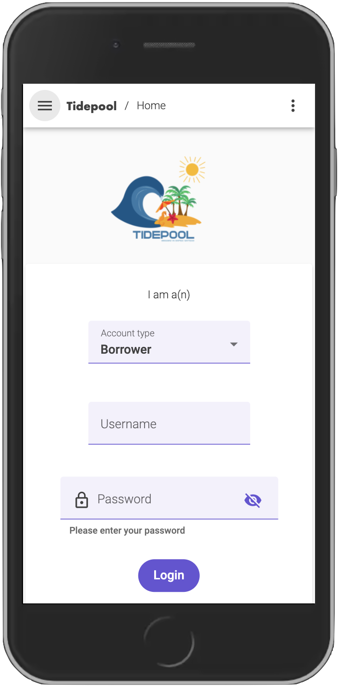
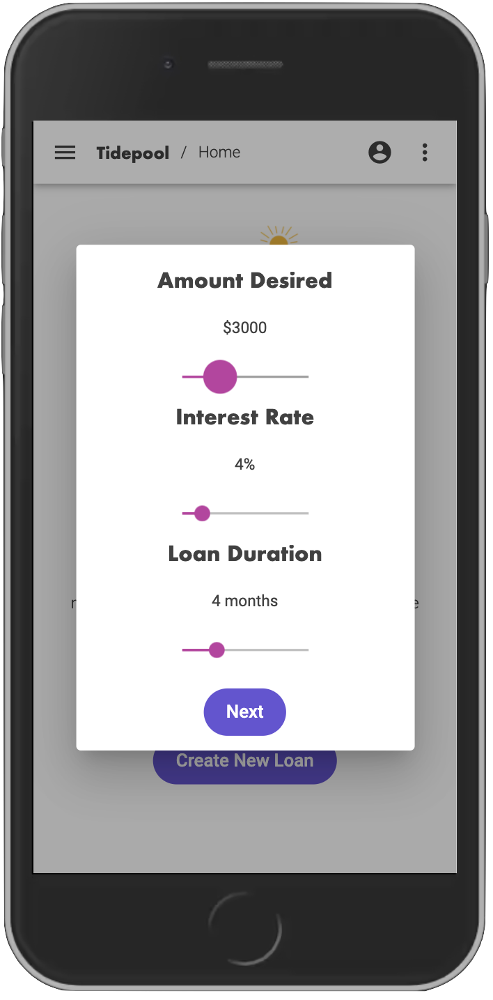
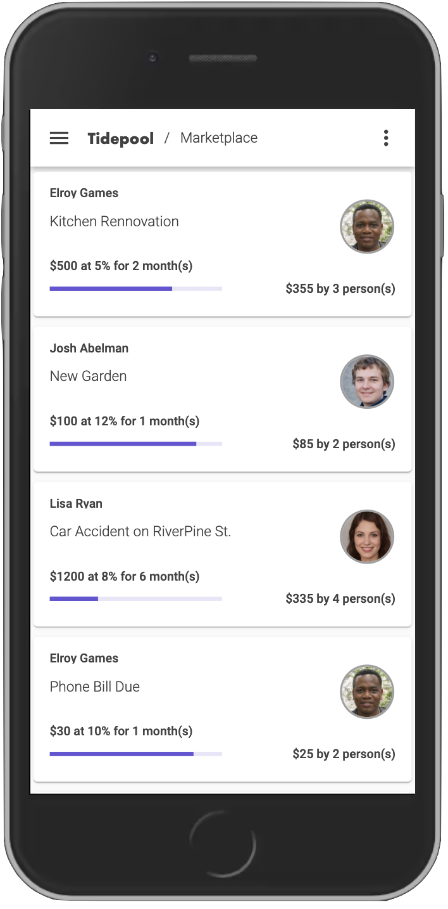
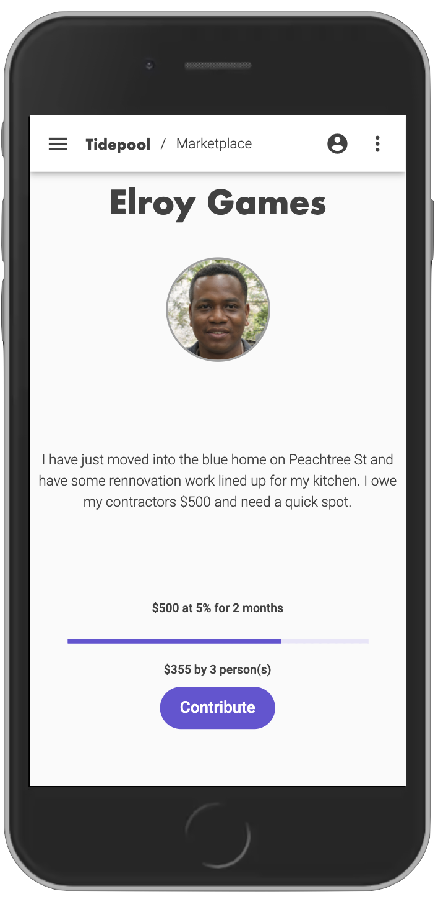
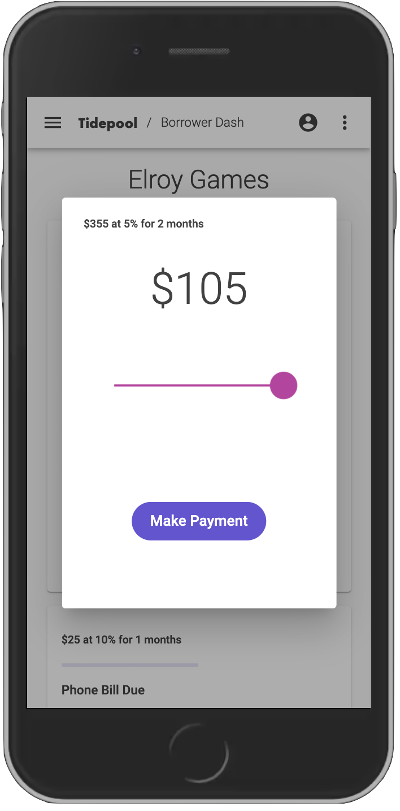
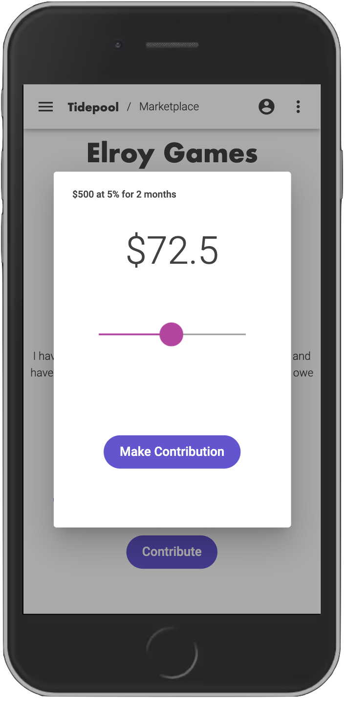
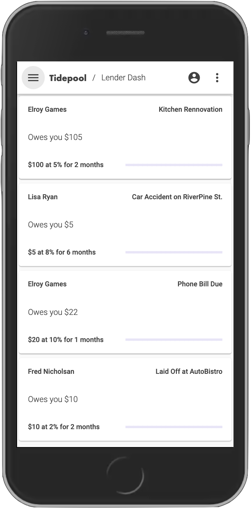

## TidePool 


## Problem
Every year, millions of individuals and small businesses need access to small amounts of capital to stay afloat. From simply needing a spot advance to cover a mortgage payment, to a local coffee shop needing a new espresso machine, borrowers are forced to turn towards payday loans with unfair interest rates or enter into a time-consuming process to secure a micro-loan from only a handful of micro-lenders in the US.

This constant battle of high interest and time sensitivity entraps millions of our community members in debt and sets up them up for  failure.

## Solution 
Tidepool is a community driven peer to peer lending platform powered by blockchain that integrates with your community bank’s Malauzai digital banking solution. It’s a suite of APIs that enable a community driven marketplace right on Finastra’s own private blockchain. 

## Why Blockchain? 
Why blockchain? With traditional lending, users need loan officers, banks, underwriters, loan processors, and many other resources. The addition of middlemen and strict regulation leads to high fees, enormous interest rates, and a complex and lengthy loan process. Smart contracts allow us to create a digital footprint of your loan and syndicate it to thousands of investors seeking to make their community a better place.


## Project Structure 

* /contracts - a directory that holds all of the solidity smart contract files
* /migrations - a directory that holds smart contract migrations
* /build - a directory that holds smart conract builds 
* /test - a directory that holds smart contract tests 
* /app - a directory that contains the following:
  * ganacheconnector.py - a python class that utilizes web3 to read between our smart contract deployed on our blockchain and our application
  * simulator.py -  a simulator to kickoff interactions in the marketplace (for demo purposes)
  * app.py -  a flask application with endpoints for marketplace and smart contract functionality
  * model_classifier.py - a python file that holds functions for a neural network zero-shot transformer model for classification of loan descriptions 
* truffle-config.js - truffle configuration file 


## App Installation
TidePool's technology stack consists of the following:
<ul>
<li>Angular - Our front end mobile application</li>
<li>Ganache - A blockchain test environment  </li>
<li>Truffle - Our development environment, testing framework and asset pipeline for blockchains using the Ethereum Virtual Machine (EVM)</li>
<li>Solidity - The language our smart contract was developed in</li>
<li>Python - Web3 connection to our blockchain and smart contract, pytorch deep learning based transformer model for classifcation, data manipulation</li>
<li>Flask - web service for development of endpoints</li>
</ul>

To get started, please ensure that you have truffle, ganache, & python 3.7. Once installed, please ensure the following python libraries are installed:

<ul>
<li>Flask</li>
<li>Pandas</li>
<li>Numpy</li>
<li>Web3</li>
<li>Sentence Transformers</li>
<li>Jupyter</li>
</ul>

Open a new terminal window and run
```bash
ganache-cli --networkId 4447 --m "equip stuff labor alpha moment rally program sting suggest bulk mesh abuse"
```
This will launch Ganache with networkId 4447 on your local machine with seed values that will work with our simulator for populating a marketplace. 

Next, open a new terminal window and change direrctories to the root of the project direrctory. Then run, 

```bash
truffle compile
```

This will compile the solidity contract. Once successful, run 

```bash
truffle migrate
```

This will deploy the smart contract on ganache and provide us with our contract address. 

Next, open one more terminal window and cd to the same root directory. From here, run 

```bash
jupyter notebook
```

Go into the directory called *app* and open the jupyter notebook called *simulator2.ipynb*. Run all cells. This will simulate some borrowers and investors interacting in the marketplace. 


Navigate to a new google chrome window and in your address bar you can test the following endpoints:

Get all information around the investors on the blockchain:

`http://localhost:5000/get_all_investors_info`

Get all information around the borrowers on the blockchain:

`http://localhost:5000/get_all_borrowers_info`

Get all current marketplace loans on the blockchain:

`http://localhost:5000/get_marketplace_loans` 

Get information about a borrower from their public key:

`http://localhost:5000/get_borrower_info_by_address?address=0x04C2CcCf58ff9C74C40d5B90C241D3c56dB259e9`

Get information about an investor from their public key:

`http://localhost:5000/get_investor_info_by_address?address=0x199510150ED1A48CC7D722450f9A8Ed663b0Cbe5`

Get all investor details and payback information for a borrower:

`http://localhost:5000/get_borrower_paybacks?address=0x8B6D23aa533B01eacF790eBfB2af7eFa08e4f3B8` 

Get all loan contracts an investor has funded:

`http://localhost:5000/get_investor_loan_contracts?&address=0x199510150ED1A48CC7D722450f9A8Ed663b0Cbe5`

Create a new loan, have it added to the blockchain and marketplace:

`http://localhost:5000/create_loan?short_description=lunch&loan_description=need%20lunch%20for%20the%20week&start_date=2021-03-05&loan_duration=4&loan_amount=5000&interest_rate=33&borrower_address=0x04C2CcCf58ff9C74C40d5B90C241D3c56dB259e9` 

Fund a loan and have a smart contract created:

`http://localhost:5000/fund_loan?loan_id=1&funding_amount=10&investor_address=0x242C90083460c262C092a7fD93615BbF7ff7A380`

Borrower payback to an investor with smart contrat execution and blockchain transaction:

`http://localhost:5000/payback_investor?loan_id=3&investor_address=0x199510150ED1A48CC7D722450f9A8Ed663b0Cbe5&payback_amount=15&borrower_address=0x9eBbb86593b4B6212FEA6c7905EAA85b352cf9Ea`

Get information about a loan id:

`http://localhost:5000/get_single_loan_struct_info?loan_id=4`

Query deep learning model on loan description to get classification:

`http://localhost:5000/get_tag?loan_description=I%20need%20a%20few%20dollars%20to%20help%20out%20with%20some%20bills%20for%20my%20broken%20leg`

To launch the Angular application, launch a new terminal window and change directories to the project root. Then run, 

`npm install`

`ng serve`


Navigate to the localhost and you will see a login screen. You can log in as an investor or borrower. To log in as a borrower use elroy.games@gmail.com. To login as an investor try lisa.ryan@gmail.com. Click around and you will see the following screens:

##       


## Demo 

To see a demo in action check out the following link where we explain the concept of TidePool and how the application works:


## License

[MIT](https://choosealicense.com/licenses/mit/)